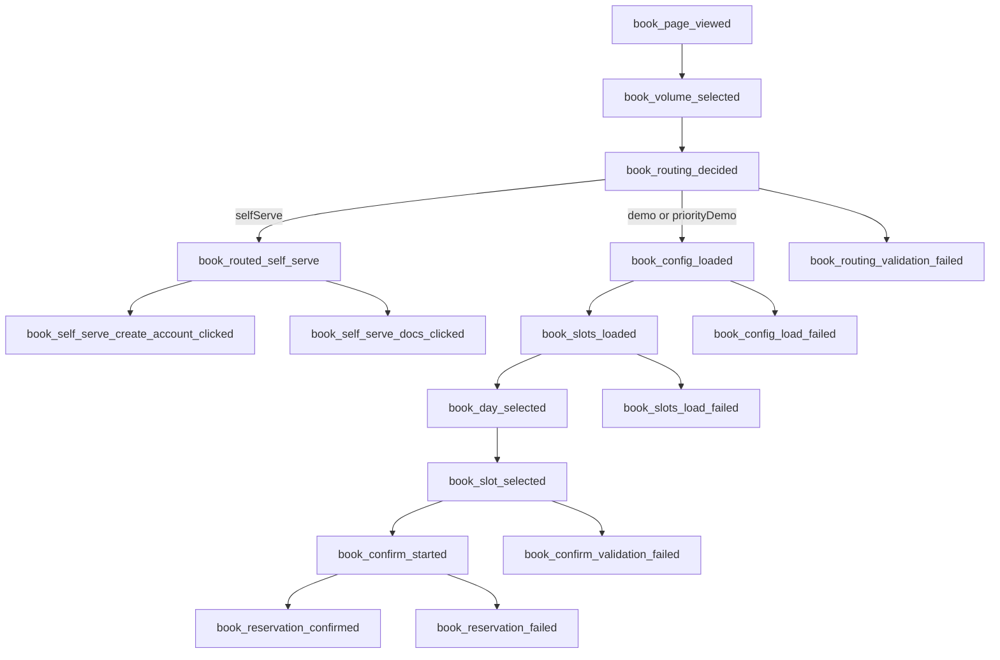

# lettr-web

Landing site for Lettr, built with SvelteKit 2, Svelte 5, TypeScript, and Tailwind CSS v4.

## Stack

- SvelteKit + Svelte 5 (runes)
- TypeScript (strict mode)
- Tailwind CSS v4
- GSAP animations
- Three.js canvas effects
- Vitest unit tests

## Setup

```sh
pnpm install
```

## Development

```sh
pnpm dev

# expose dev server on local network
pnpm dev -- --host
```

## Quality checks

```sh
# static checks (Svelte + TypeScript)
pnpm check

# unit tests
pnpm test:unit

# watch mode for unit tests
pnpm test:unit:watch
```

Run a single test file:

```sh
pnpm vitest src/path/to/file.test.ts
```

Run one test by name:

```sh
pnpm vitest -t "test name"
```

## Build and preview

```sh
pnpm build
pnpm preview
```

## Notable structure

- `src/routes/+layout.svelte`: global layout shell and page metadata
- `src/lib/components/SplineFooter.svelte`: lazy-loaded Spline footer scene wrapper
- `src/lib/utils/spline.ts`: Spline visibility gating and script loader utilities
- `src/lib/components/BorderLinesCanvas.svelte`: animated Three.js border lines
- `src/lib/utils/shiki.ts`: syntax highlighting setup and singleton highlighter

## Booking analytics funnel (PostHog)

The `/demo` flow is instrumented with PostHog events in `src/routes/demo/+page.svelte`.



Shared event properties are attached to each event:

- `funnel_name`: `booking_funnel`
- `funnel_version`: `1`
- `page`: `/demo`
- `timezone`: client timezone
